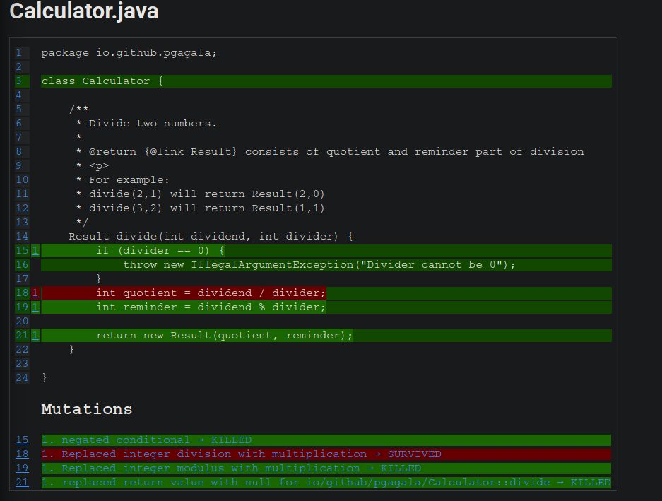

# Why ?

We got a contract to implement a divide method.
Divide operation calculates quotient and reminder as a result of that calculation.

```java

Result divide(int dividend, int divider);

class Result {
    int quotient;
    int reminder;
}

```

For example:
 - `divide(2,1)` should return `io.github.pgagala.Result(2,0)`
 - `divide(3,2)` should return `io.github.pgagala.Result(1,1)`
       
We figured out that our class reflects behaviour of calculator, so we called that class as it. 
Of course, we are high quality developers, so we want to provide good tests in first order for that cases.

Lets provide some:

```groovy

class CalculatorSpec extends Specification {

    @Shared
    Calculator calculator = new Calculator()

    def "Should correctly divide numbers"() {
        when: "number are divided"
            def result = calculator.divide(3, 3)
        then: "correct result should be returned"
            result == new Result(1, 0)
    }

    def "Should throw exception for 0 divider"() {
        when: "number are divided with 0 divider"
            calculator.divide(1, 0)
        then: "Exception should be thrown"
            thrown IllegalArgumentException
    }

}
```

All tests are red which is good we don't have any implementations so far. 
Let's provide simple one:

```java
    Result divide(int dividend, int divider) {
        if(divider == 0) {
            throw new IllegalArgumentException("Divider cannot be 0");
        }
        int quotient = dividend / divider;
        int reminder = dividend % divider;

        return new Result(total, reminder);
    }
``` 

Now test are passing, what is more we got full test coverage (with might be misleading). 
Take a look closer if everything is fine with them.
That is easy example, so You will probably notice that we don't have enough test cases for
testing `divide` operation.
Although in more complex scenarios that might be not so easily noticeable.
Why not enough test examples?
Imagine that some developer what to change the internal algorithm of divide operation 
(not focus on how reasonable that change is in that context).
Change will be as following:
```java
    Result divide(int dividend, int divider) {
        if(divider == 0) {
            throw new IllegalArgumentException("Divider cannot be 0");
        }
        int quotient = dividend / divider;   --->   int quotient = dividend * divider; 
        int reminder = dividend % divider;

        return new Result(total, reminder);
    }
```
Even change breaks the logic of algorithm after we run our tests, they will be still passing - that is not good.
Definitely there is some missing indicator that something is wrong with that tests.  

       
# What ?
Mutation testing can help us with that situation.
Describing in one sentence mutation testing are testing of tests. 

Ok so what they are doing:

1) Change application code on different ways (introduce mutants)
2) Run tests against mutants
3) Generate reports with results of running tests against mutants
4) If test failed running against particular mutant it is described as mutant killed, otherwise mutant survived  

In our example mutant was simple changing `int quotient = dividend / divider;` to `int quotient = dividend * divider;`.
Thanks to that even we are missing test cases that will be shown in report generated by mutation testing. 
Mutation testing usually generates much more mutants. Then tests will be run against each mutant. So if based on our application code e.g.
3 mutants were generated, tests will be run against those all 3. 

Results should be manually analyzed and based on that we can figure out what is missing.
Killing mutant is good, but not all survived mutants are bad.

For example lets take a look on code below

```java
i = 4;
if(i >= 3) {
    return value;
}
```

After applying one of mutation that code can look like:
```java
i = 4;
if(i > 3) {
    return value;
}
```

The fact that mutation survived is definitely not a problem. That is why those reports should be manually checked 
(at least at that moment, or I might don't know about some super tool available currently).


# How ?

One of best known and good tool is a `pitest`.
I will show how to use it using gradle plugin for that tool (https://github.com/szpak/gradle-pitest-plugin).

1) Apply plugin to `build.gradle`

```groovy

plugins {
    id 'info.solidsoft.pitest' version '1.5.2'
}

pitest {
    //https://github.com/pitest/pitest-junit5-plugin
    junit5PluginVersion = '0.12'

    //classes on which mutation should be applied
    targetClasses = ['io.github.pgagala.*']

    //tests which should be used to check if mutations on target classes survived
    targetTests = ['io.github.pgagala.*']

    //which test classes we want to exclude (typically integration spec)
    excludedTestClasses = ['*IntegrationSpec']

    //which methods we want to exclude from mutation testing
    excludedMethods = ['hashCode','equals']

    //on how many threads mutation testing should be run
    threads = 4

    //format of report
    outputFormats = ['HTML']

    //disable generate reports inside timestamped folder every run
    timestampedReports = false
    
    //skip analysis if codebase hasn't changed -  https://pitest.org/quickstart/incremental_analysis/
    enableDefaultIncrementalAnalysis = true
}
```
There are more options to configure, but those shown above are most important in my opinion.

2) Run `./gradlew pitest` (or `gradle pitest` without wrapper)

3) In `./build/reports/pitest` there will be a `index.html` with mutation testing report

4) In report that is clearly described which mutation wasn't killed




5) After changing test accordingly and rerun tests all mutations are killed.

```groovy
class CalculatorFixedSpec extends Specification {

    @Shared
    Calculator calculator = new Calculator()

    def "Should correctly divide numbers"() {
        when: "number are divided"
            def result = calculator.divide(4, 3)
        then: "correct result should be returned"
            result == new Result(1, 1)
    }

    def "Should throw exception for 0 divider"() {
        when: "number are divided with 0 divider"
            calculator.divide(1, 0)
        then: "Exception should be thrown"
            thrown IllegalArgumentException
    }

}
```

Quality of tests definitely increased.


# Applying to production code

Everything looks shiny and beautiful but as always reality is now so sweet at all.
Applying mutation testing to real production example is not so easy.

## Problems:
1) As in production we got many code time necessary for performing all tests against mutants takes a long (but that can be somehow solved using `enableDefaultIncrementalAnalysis` parameter)
2) Generating mutations and running tests against all of them is time-consuming for unit tests, for integration tests that is much worse so very possible that even mutation can be killed by one of integration tests that won't be shown (because integration tests were skipped)
3) Reviewing mutation testing report is still manual process, so that required discipline

## My suggestions:
1) Enable `enableDefaultIncrementalAnalysis` to save some time during performing mutation testing
2) Narrow scope of mutation testing to place where You are working on - e.g. package/packages (then reports won't be so overwhelming). 
E.g. I am working in `foo.bar` package, then `targetClasses` and `targetTests` should be set to `['foo.bar']  
3) Base on unit tests not on integration tests in mutation testing (exclusion of integration tests from scope, e.g. `excludedTestClasses = ['*IntegrationSpec']` if Your tests ends with 
IntegrationSpec) - that required reasonable code coverage in unit tests   

# Links
https://pitest.org/quickstart/mutators/ - pitest mutators

https://pitest.org/quickstart/commandline/ - pitest commands

https://pitest.org/quickstart/incremental_analysis/ - pitest incremental analysis

https://gradle-pitest-plugin.solidsoft.info/ - pitest gradle plugin description

https://github.com/szpak/gradle-pitest-plugin/blob/master/src/main/groovy/info/solidsoft/gradle/pitest/PitestPluginExtension.groovy - all commands
for pitest gradle plugin
